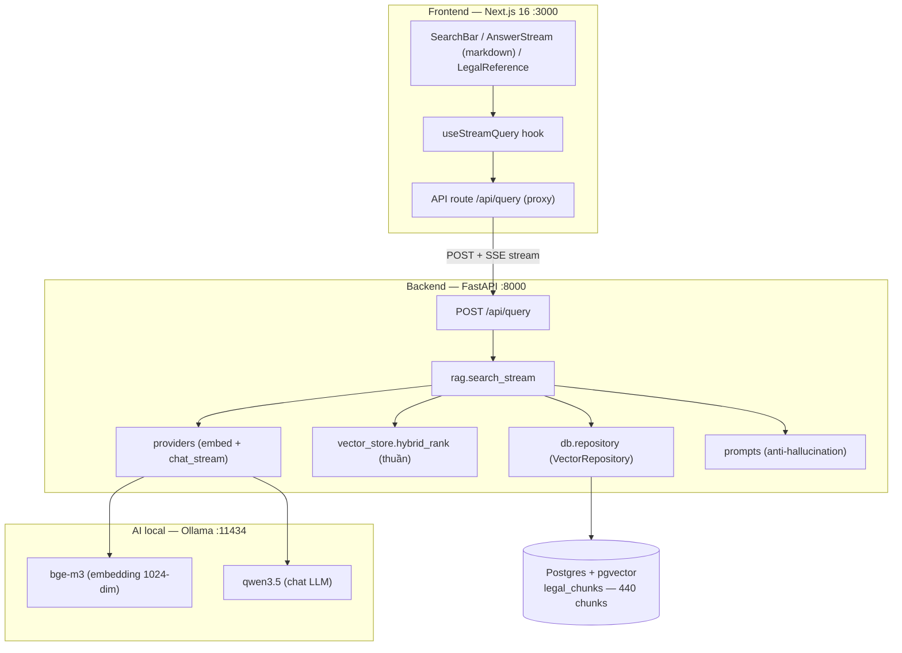
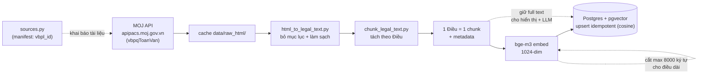
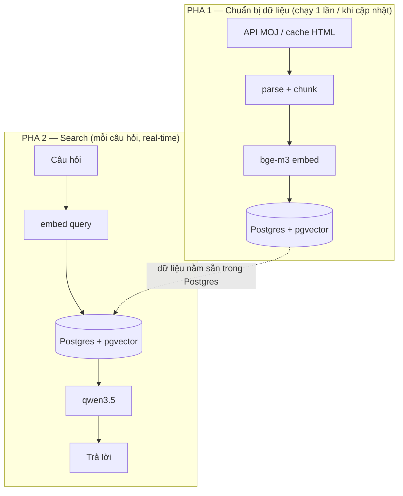
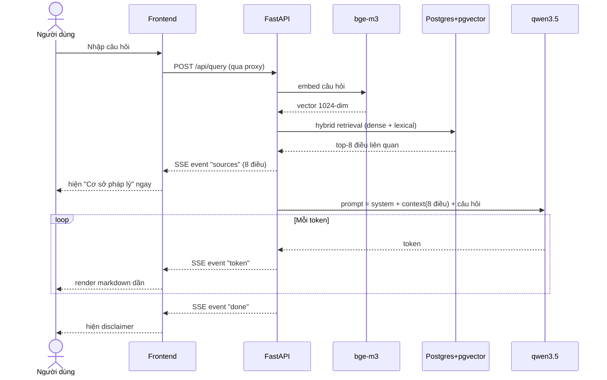
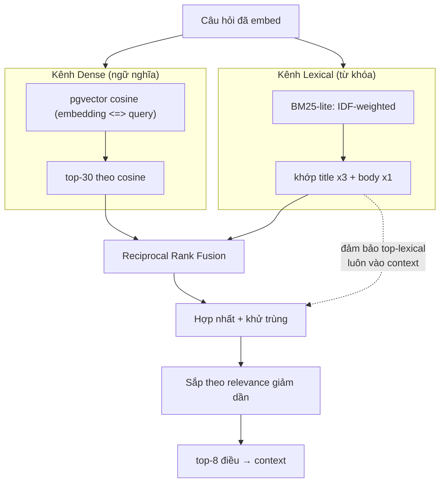
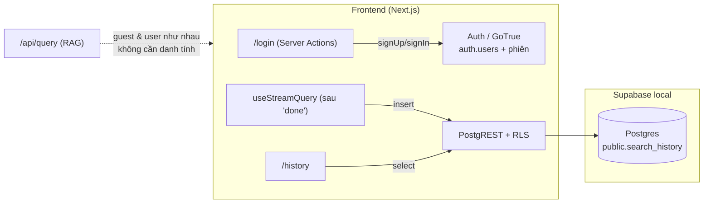

# Kiến trúc & Flow RAG — PoC Trợ lý Luật Nhà ở

> Tài liệu này mô tả **implementation thực tế** của PoC (do agent sinh ra khi code),
> khác với `docs/01-basic-design/` và `docs/02-detail-design/` là nguồn thiết kế gốc
> từ khách hàng.

## Tổng quan

Tra cứu pháp luật Việt Nam bằng RAG (Retrieval-Augmented Generation), phạm vi: **Luật Nhà ở
2023 (27/2023/QH15)** + bộ văn bản quy định chi tiết (NĐ 95, 98, 100/2024 và TT 05/2024/TT-BXD).
Đối tượng: người dân phổ thông. AI embedding/chat chạy **local qua Ollama** (chat có thể chuyển
Claude API qua config).

| Tầng | Công nghệ | Cổng |
|------|-----------|------|
| Frontend | Next.js 16 (App Router), Tailwind, react-markdown | 3000 |
| Backend | Python 3.12, FastAPI | 8000 |
| Kho + Auth | **Supabase local** (Postgres + pgvector + Auth/GoTrue), quản qua migrations | 54421 API / 54422 DB |
| Embedding | Ollama `bge-m3` (1024-dim, đa ngôn ngữ) | 11434 |
| Chat LLM | Provider abstraction: `qwen3.5` (Ollama, mặc định) hoặc `claude-sonnet-4-6` (Claude API) — chọn qua config | 11434 / API |

> Ghi chú cổng: project này dùng dải **544xx** cho Supabase local (đổi từ mặc định 543xx) để
> chạy song song với một project Supabase khác trên cùng máy.

## 1. Kiến trúc tổng thể

Tách 2 tầng: **frontend Node** và **backend Python**, nối qua Next.js API route proxy
(tránh CORS, giấu URL Ollama phía server).

## 2. Flow Ingestion (offline, tự động hoàn toàn)

**Một lệnh duy nhất, không cần browser:** `cd backend && uv run python scripts/ingest.py`
— tự động áp schema (idempotent), **fetch toàn văn từ API Bộ Tư pháp** (nếu chưa có cache),
parse → chunk → embed → **upsert** vào Postgres cho **mọi** tài liệu trong `scripts/sources.py`.
Upsert theo khoá `(document_id, article_number)` nên chạy lại không nhân bản. Kết quả:
198 (Luật) + 95 (NĐ 95) + 48 (NĐ 98) + 78 (NĐ 100) + 21 (TT 05) = **440 chunks** từ 5 văn bản.

**Thêm văn bản mới:** tìm `ItemID` trên vbpl.vn (số cuối URL chi tiết) → thêm 1 dòng
vào `SOURCES` trong `sources.py` → chạy lại lệnh trên. Không tải tay, không sửa code.

> **Nguồn dữ liệu:** trang web vbpl.vn có reCAPTCHA, nhưng backend của nó
> (`apipacs.moj.gov.vn/api/vbpl/document?id={ItemID}`) là **API công khai không cần
> auth**, trả toàn văn trong field `vbpqToanVan`. `fetch_sources.py` gọi API này →
> bỏ hoàn toàn bước tải thủ công. HTML fetch về vẫn cache trong `data/raw_html/` để
> tái lập offline. Làm mới: `uv run python scripts/fetch_sources.py`.

## 2b. Hai pha tách biệt — chuẩn bị dữ liệu vs. Search

Ingestion và Search **hoàn toàn độc lập**. Search **không bao giờ**
truy cập vbpl.vn hay API — nó chỉ đọc **Postgres + pgvector** + gọi Ollama **local** (chạy
được cả khi offline, miễn Postgres đang chạy).

Người dùng cuối (người dân tra cứu) chỉ tương tác với Pha 2 — không bao giờ đụng bước
chuẩn bị dữ liệu. `ingest.py` giống bước **"cài đặt / cập nhật dữ liệu"**, còn search là
**"dùng app"**.

**Khi nào chạy lại Pha 1** (không phải mỗi lần search):

| Trường hợp | Lệnh |
|---|---|
| Thêm luật mới vào phạm vi | Thêm `vbpl_id` vào `sources.py` → `uv run python scripts/ingest.py` |
| Luật được sửa đổi (có bản mới) | `uv run python scripts/fetch_sources.py` → `ingest.py` |
| Đổi embedding model | `uv run python scripts/ingest.py` |

## 3. Flow Query / RAG (real-time)

> **Sự kiện SSE `error`:** nếu chat provider lỗi **giữa chừng** stream (mất mạng/timeout),
> API phát `error` thay cho `done`; frontend báo lỗi rõ ràng và không coi phần token đã
> nhận là câu trả lời hoàn chỉnh (FR-011).

## 4. Cơ chế Hybrid Retrieval

**Vì sao cần hybrid:** bge-m3 mạnh ngữ nghĩa nhưng đôi khi lệch từ khóa (vd câu hỏi
"thời hạn **sở hữu**" vs điều luật "thời hạn **sử dụng**"). Kênh lexical bắt khớp tiêu đề,
kênh dense bắt ý nghĩa — RRF gộp lại cho recall tốt nhất. Xem thêm quyết định D2/D2b tại
[`docs/04-decisions/2026-07-03-poc-tech-choices.md`](04-decisions/2026-07-03-poc-tech-choices.md).

## 5. Ba cơ chế an toàn cho trợ lý pháp lý

| Cơ chế | Cách làm | File |
|--------|----------|------|
| **Retrieve đúng nguồn** | Chỉ lấy 8 điều liên quan nhất, không nhồi cả bộ luật | `services/vector_store.py` |
| **Generate có căn cứ** | Prompt buộc LLM chỉ dùng context, cấm nêu điều/luật ngoài context | `prompts/system.py` |
| **Từ chối khi ngoài phạm vi** | Không đủ dữ liệu → trả câu từ chối cố định, không bịa | `prompts/system.py` |

## 6. Tham chiếu module

| Bước | Module | Vai trò |
|------|--------|---------|
| Ingest | `scripts/sources.py` | Manifest khai báo tài liệu (vbpl_id, doc_id) |
| Ingest | `scripts/fetch_sources.py` | Fetch toàn văn từ API Bộ Tư pháp (không browser) |
| Schema | `supabase/migrations/*.sql` | Nguồn schema (legal_chunks + search_history + RLS); `supabase db reset` |
| Ingest | `scripts/ingest.py` | **1 lệnh**: fetch → text → chunk → embed → upsert (bảng do migrations tạo) |
| Ingest | `scripts/html_to_legal_text.py` | HTML vbpl → text sạch (bỏ mục lục) |
| Ingest | `scripts/chunk_legal_text.py` | Tách theo "Điều", gắn metadata |
| Query | `routers/query.py` | Endpoint SSE `POST /api/query` |
| Query | `services/rag.py` | Điều phối: retrieve (repository) → hybrid_rank → prompt → stream |
| Query | `db/repository.py` | `VectorRepository` (seam) + `PgVectorRepository` (psycopg3/pgvector) |
| Query | `db/connection.py` | Pool Postgres async + đăng ký pgvector; fail-fast thiếu config |
| Query | `services/vector_store.py` | `hybrid_rank` — hàm thuần dense + lexical RRF (không đụng DB) |
| Query | `providers/base.py` | Interface `ChatProvider` / `EmbeddingProvider` (Protocol) |
| Query | `providers/ollama.py` | Ollama chat (qwen3.5) + embedding (bge-m3) |
| Query | `providers/claude.py` | Claude chat streaming (Anthropic SDK) |
| Query | `providers/factory.py` | Chọn provider theo config (`chat_provider`/`embedding_provider`) |
| Query | `prompts/system.py` | System prompt chống hallucination |
| UI | `hooks/useStreamQuery.ts` | Parse SSE stream + ghi lịch sử sau `done` (nếu đăng nhập) |
| UI | `components/result/AnswerStream.tsx` | Render câu trả lời markdown |
| UI | `components/result/LegalReference.tsx` | Accordion "Cơ sở pháp lý" |
| Auth | `proxy.ts` (Next 16) | Refresh phiên Supabase, đồng bộ cookie httpOnly |
| Auth | `lib/supabase/{client,server}.ts` | Supabase client (browser anon key / server cookies) |
| Auth | `app/login/actions.ts` | Server Actions signIn/signUp/signOut (Supabase Auth) |
| Auth | `components/auth/*`, `components/layout/Header.tsx` | Form đăng nhập + trạng thái user |
| History | `lib/history.ts` | Ghi `search_history` qua Supabase (RLS); guest bỏ qua |
| History | `app/history/page.tsx` | Xem lịch sử của mình (RLS tự lọc theo `auth.uid()`) |

## 7. Tài khoản & lịch sử tra cứu (Supabase)

Auth và lịch sử là **frontend + Supabase**; backend RAG **không** tham gia (không biết danh tính).

- **Phiên**: Supabase quản (`auth.sessions`); `@supabase/ssr` giữ trong **cookie httpOnly**;
  `proxy.ts` refresh mỗi request. Frontend chỉ dùng **anon key** — `service_role` không lộ ra client.
- **Cô lập**: `search_history` bật **RLS** (`user_id = auth.uid()`) — user chỉ đọc/ghi hàng của mình,
  kể cả gọi thẳng PostgREST (kiểm bằng test `backend/tests/test_rls_isolation.py`).
- **Guest**: `saveHistory` bỏ qua khi chưa đăng nhập; tra cứu vẫn hoạt động đầy đủ.
- **Lịch sử tối thiểu**: `query + created_at + sources` (điều trích) — không lưu toàn văn câu trả lời.
